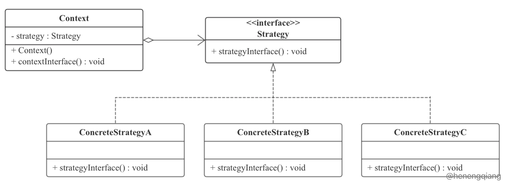

# java-thoughts
 * &nbsp;&nbsp; Java Hodgepodge

## -- contents --
 
### design-patterns module
 * &nbsp;&nbsp; When writing code, there will always be a lot of if...else, or case. If you include more than 
 one conditional statement in a conditional statement, the code will become bloated, the cost of maintenance will increase, 
 and the strategy mode will solve this problem better.  
 * &nbsp;&nbsp; The strategy pattern defines a set of algorithms and encapsulates each algorithm so that they can be 
 replaced with each other, allowing the algorithm to change independently of the client using it.
 * &nbsp;&nbsp; Analysis of the definition, the strategy pattern defines and encapsulates a series of algorithms, 
 they can be replaced, that is, they have commonality, and their commonality is reflected in the behavior of the 
 policy interface, and in order to achieve the purpose of the last sentence That is, letting the algorithm 
 change independently of the client that uses it, we need to make the client depend on the policy interface.
 * &nbsp;&nbsp; The usage situation of the strategy mode:  
   * &nbsp;&nbsp; 1. A variety of treatments for the same type of problem, only when there are differences in specific behaviors;  
   * &nbsp;&nbsp; 2. Need to safely package multiple operations of the same type;  
   * &nbsp;&nbsp; 3. When the same abstract class has multiple subclasses, you need to use if-else or switch-case 
 to select a specific subclass.  
 * &nbsp;&nbsp; UML Class picture:  
   
 * &nbsp;&nbsp; This pattern involves three roles:  
 &nbsp;&nbsp; Context role: Hold a reference to a Strategy.  
 &nbsp;&nbsp; Abstract strategy: This is an abstract role, usually implemented by an interface or abstract class. 
 This role gives the interfaces required for all specific policy classes.  
 &nbsp;&nbsp; ConcreteStrategy role: Wraps related algorithms or behaviors.  
 
### popular-tech module
 * Contains the latest, latest and hottest technologies
   * blockchain   
   See [blockchain](https://baike.baidu.com/item/区块链/13465666?fr=aladdin)