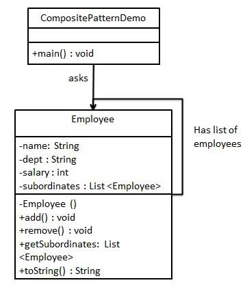

# java-thoughts
 * Java Hodgepodge（Java大杂烩）

## -- contents --
 
### popular-tech module
 * Contains the latest, latest and hottest technologies
   * Blockchain   
   See [blockchain](https://baike.baidu.com/item/区块链)
   * Java date new api: The new date api of JDK8
   * Common tools
 
### design-patterns module
 * When writing code, there will always be a lot of if...else, or case. If you include more than 
 one conditional statement in a conditional statement, the code will become bloated, the cost of maintenance will increase, 
 and the strategy mode will solve this problem better.    
 
 --- 
 
 **Strategy mode**
 * The strategy pattern defines a set of algorithms and encapsulates each algorithm so that they can be 
 replaced with each other, allowing the algorithm to change independently of the client using it.
 * Analysis of the definition, the strategy pattern defines and encapsulates a series of algorithms, 
 they can be replaced, that is, they have commonality, and their commonality is reflected in the behavior of the 
 policy interface, and in order to achieve the purpose of the last sentence That is, letting the algorithm 
 change independently of the client that uses it, we need to make the client depend on the policy interface.
 * The usage situation of the strategy mode:  
   * 1.A variety of treatments for the same type of problem, only when there are differences in specific behaviors;  
   * 2.Need to safely package multiple operations of the same type;  
   * 3.When the same abstract class has multiple subclasses, you need to use if-else or switch-case 
 to select a specific subclass.  
 * UML Class picture:  
   
 * This pattern involves three roles:  
   * Context role: Hold a reference to a Strategy.  
   * Abstract strategy: This is an abstract role, usually implemented by an interface or abstract class. 
 This role gives the interfaces required for all specific policy classes.  
   * ConcreteStrategy role: Wraps related algorithms or behaviors. 
 
 ---
 
 **Factory mode（工厂模式）**
 * Intent: Define an interface to create an object, let its subclasses decide which factory class to instantiate, 
 and the factory mode delays the creation process to subclasses.  
 （意图：定义一个创建对象的接口，让其子类自己决定实例化哪一个工厂类，工厂模式使其创建过程延迟到子类进行。）
 * The main solution: mainly solve the problem of interface selection.  
 （主要解决：主要解决接口选择的问题。）
 * When to use: We explicitly plan to create different instances under different conditions.  
 （何时使用：我们明确地计划不同条件下创建不同实例时。）
 * How to solve: Let its subclass implement the factory interface, and return an abstract product.  
 （如何解决：让其子类实现工厂接口，返回的也是一个抽象的产品。）
 * Key code: The creation process is performed in its subclasses.  
 （关键代码：创建过程在其子类执行。）
 * Application examples: 1. You need a car, you can pick up the goods directly from the factory, instead of how to make 
 the car, and the specific implementation of the car. 2, Hibernate to change the database just need to change dialects and drivers.    
 （应用实例： 1、您需要一辆汽车，可以直接从工厂里面提货，而不用去管这辆汽车是怎么做出来的，以及这个汽车里面的具体实现。 2、Hibernate 换数据库只需换方言和驱动就可以。）
 * Advantages: 1. A caller wants to create an object, as long as he knows its name. 2, high scalability, if you want to 
 add a product, just extend a factory class. 3. The specific implementation of the shielded product, 
 the caller only cares about the interface of the product.  
 （优点： 1、一个调用者想创建一个对象，只要知道其名称就可以了。 2、扩展性高，如果想增加一个产品，只要扩展一个工厂类就可以。 3、屏蔽产品的具体实现，调用者只关心产品的接口。）
 * Disadvantages: Each time you add a product, you need to add a concrete class and object to implement the factory, 
 so that the number of classes in the system is multiplied, which increases the complexity of the system to a certain extent, 
 and also increases the system specific class rely. This is not a good thing.  
 （缺点：每次增加一个产品时，都需要增加一个具体类和对象实现工厂，使得系统中类的个数成倍增加，在一定程度上增加了系统的复杂度，同时也增加了系统具体类的依赖。这并不是什么好事。）
 * Usage scenarios: 1. Logger: The record may be recorded to the local hard disk, system events, remote server, etc. 
 The user can choose where to log the log. 2, database access, when the user does not know which type of database the system uses, 
 and the database may change. 3, design a framework to connect to the server, you need three protocols, "POP3", "IMAP", "HTTP",
 you can use these three as a product class to achieve an interface.  
 （使用场景： 1、日志记录器：记录可能记录到本地硬盘、系统事件、远程服务器等，用户可以选择记录日志到什么地方。 2、数据库访问，当用户不知道
 最后系统采用哪一类数据库，以及数据库可能有变化时。 3、设计一个连接服务器的框架，需要三个协议，"POP3"、"IMAP"、"HTTP"，可以把这三个作为产品类，共同实现一个接口。）
 * Note: As a way to create a class, you can use the factory method mode wherever you need to generate complex objects. 
 One thing to note is that complex objects are suitable for factory mode, while simple objects, especially those that only 
 need to be created by new, do not need to use factory mode. If you use the factory pattern, you need to introduce a factory class, 
 which will increase the complexity of the system.  
 （注意事项：作为一种创建类模式，在任何需要生成复杂对象的地方，都可以使用工厂方法模式。有一点需要注意的地方就是复杂对象适合使用工厂模式，
 而简单对象，特别是只需要通过 new 就可以完成创建的对象，无需使用工厂模式。如果使用工厂模式，就需要引入一个工厂类，会增加系统的复杂度。）    
 * UML Class picture:  
    
  
 ---
  
 **Abstract Factory Pattern(抽象工厂模式)**
 * The Abstract Factory Pattern creates other factories around a super factory. This super factory is also known as the 
 factory of other factories. This type of design pattern is a creative model that provides the best way to create objects.  
 In abstract factory mode, an interface is a factory that is responsible for creating a related object, without explicitly 
 specifying their class. Each generated factory can provide objects in factory mode.   
 （抽象工厂模式（Abstract Factory Pattern）是围绕一个超级工厂创建其他工厂。该超级工厂又称为其他工厂的工厂。这种类型的设计模式属于创建型模式，
 它提供了一种创建对象的最佳方式。在抽象工厂模式中，接口是负责创建一个相关对象的工厂，不需要显式指定它们的类。每个生成的工厂都能按照工厂模式提供对象。）  
 * Intent: Provides an interface to create a series of related or interdependent objects without specifying their specific classes.  
 （意图：提供一个创建一系列相关或相互依赖对象的接口，而无需指定它们具体的类。）  
 * The main solution: mainly solve the problem of interface selection.  
 （主要解决：主要解决接口选择的问题。）
 * When to use: The system's products have more than one product family, and the system consumes only one of the products.  
 （何时使用：系统的产品有多于一个的产品族，而系统只消费其中某一族的产品。）
 * How to solve: Define multiple products in one product family.  
 （如何解决：在一个产品族里面，定义多个产品。）
 * Key code: Aggregate multiple products in one factory.  
 （关键代码：在一个工厂里聚合多个同类产品。）
 * Application example: Work, in order to participate in some gatherings, there must be two or more sets of clothes, 
 such as business wear (set, a series of specific products), fashion (set, a series of specific products), even for a 
 family In terms of business women's wear, business men's wear, fashion women's wear, fashion men's wear, these are also 
 complete sets, that is, a series of specific products. Suppose a situation (in reality, it doesn't exist, otherwise it 
 can't enter communism, but it helps to illustrate the abstract factory model). In your home, a certain wardrobe 
 (specific factory) can only store one kind of this. The clothes (set, a series of specific products), naturally take 
 out this set of clothes every time from the wardrobe. Understand the idea of ​​OO, all the wardrobes (specific factories) 
 are one of the wardrobe type (abstract factory), and each set of clothes includes a specific top (a specific product), 
 pants (a specific Products), these specific tops are actually tops (abstract products), and the specific pants are also 
 pants (another abstract product).  
 （应用实例：工作了，为了参加一些聚会，肯定有两套或多套衣服吧，比如说有商务装（成套，一系列具体产品）、时尚装（成套，一系列具体产品），
 甚至对于一个家庭来说，可能有商务女装、商务男装、时尚女装、时尚男装，这些也都是成套的，即一系列具体产品。假设一种情况（现实中是不存在的，
 要不然，没法进入共产主义了，但有利于说明抽象工厂模式），在您的家中，某一个衣柜（具体工厂）只能存放某一种这样的衣服（成套，一系列具体产品），
 每次拿这种成套的衣服时也自然要从这个衣柜中取出了。用 OO 的思想去理解，所有的衣柜（具体工厂）都是衣柜类的（抽象工厂）某一个，而每一件成套
 的衣服又包括具体的上衣（某一具体产品），裤子（某一具体产品），这些具体的上衣其实也都是上衣（抽象产品），具体的裤子也都是裤子（另一个抽象产品）。）
 * Advantage: When multiple objects in a product family are designed to work together, it ensures that the client 
 always uses only objects from the same product family.  
 （优点：当一个产品族中的多个对象被设计成一起工作时，它能保证客户端始终只使用同一个产品族中的对象。）
 * Disadvantages: Product family extension is very difficult. To add a product in a series, you need to add code in the 
 abstract Creator and add code in the specific one.  
 （缺点：产品族扩展非常困难，要增加一个系列的某一产品，既要在抽象的 Creator 里加代码，又要在具体的里面加代码。）
 * Usage scenarios: 1, QQ for skin, a whole set together. 2. Generate programs for different operating systems.  
 （使用场景： 1、QQ 换皮肤，一整套一起换。 2、生成不同操作系统的程序。）
 * Note: The product family is difficult to expand, and the product level is easy to expand.  
 （注意事项：产品族难扩展，产品等级易扩展。）
 * UML Class picture:  
 
 
 ---
 
 **Singleton Pattern(单例模式)**
 * The Singleton Pattern is one of the simplest design patterns in Java. This type of design pattern is a creative model 
 that provides the best way to create objects.  
 This pattern involves a single class that is responsible for creating your own objects while ensuring that only a 
 single object is created. This class provides a way to access its unique object, which can be accessed directly without 
 the need to instantiate an object of that class.  
 (单例模式（Singleton Pattern）是 Java 中最简单的设计模式之一。这种类型的设计模式属于创建型模式，它提供了一种创建对象的最佳方式。
  这种模式涉及到一个单一的类，该类负责创建自己的对象，同时确保只有单个对象被创建。这个类提供了一种访问其唯一的对象的方式，
  可以直接访问，不需要实例化该类的对象。)
 * note:
   1. A singleton class can only have one instance.
   2. The singleton class must create its own unique instance.
   3. The singleton class must provide this instance to all other objects.  
 (注意： 1、单例类只能有一个实例。2、单例类必须自己创建自己的唯一实例。3、单例类必须给所有其他对象提供这一实例。)
 * Intent: Ensure that a class has only one instance and provides a global access point to access it.  
 (意图：保证一个类仅有一个实例，并提供一个访问它的全局访问点。)
 * The main solution: a globally used class is frequently created and destroyed.  
 (主要解决：一个全局使用的类频繁地创建与销毁。)
 * When to use: When you want to control the number of instances and save system resources.  
 (何时使用：当您想控制实例数目，节省系统资源的时候。)
 * How to solve: Determine whether the system already has this singleton, if it is, return it, if not, create it.  
 (如何解决：判断系统是否已经有这个单例，如果有则返回，如果没有则创建。)
 * Key code: The constructor is private.  
 (关键代码：构造函数是私有的。)
 * Application examples: 1. A party can only have one secretary. 2, Windows is multi-process multi-threaded, when 
 operating a file, it is inevitable that multiple processes or threads operate a file at the same time, so all files 
 must be processed through a unique instance. 3, some device managers are often designed as a single-case mode, such as 
 a computer with two printers, the output must be processed when two printers can not print the same file.  
 (应用实例： 1、一个党只能有一个书记。 2、Windows 是多进程多线程的，在操作一个文件的时候，就不可避免地出现多个进程或线程同时操作一个
 文件的现象，所以所有文件的处理必须通过唯一的实例来进行。 3、一些设备管理器常常设计为单例模式，比如一个电脑有两台打印机，
 在输出的时候就要处理不能两台打印机打印同一个文件。)
 * Advantages: 1. There is only one instance in memory, which reduces the memory overhead, especially the frequent 
 creation and destruction of instances (such as the management college home page cache). 2. Avoid multiple occupations 
 of resources (such as writing file operations).  
 (优点： 1、在内存里只有一个实例，减少了内存的开销，尤其是频繁的创建和销毁实例（比如管理学院首页页面缓存）。 
 2、避免对资源的多重占用（比如写文件操作）。)
 * Disadvantages: No interface, no inheritance, conflict with a single responsibility principle, a class should only 
 care about internal logic, and not care about how to instantiate it outside.  
 (缺点：没有接口，不能继承，与单一职责原则冲突，一个类应该只关心内部逻辑，而不关心外面怎么样来实例化。)
 * Usage scenarios: 1. Request to produce a unique serial number. 2, the counter in the WEB, do not need to be added once 
 in the database every time you refresh, use a single case to cache first. 3. An object created needs to consume too 
 many resources, such as the connection of I/O to the database.  
 (使用场景： 1、要求生产唯一序列号。 2、WEB 中的计数器，不用每次刷新都在数据库里加一次，用单例先缓存起来。 
 3、创建的一个对象需要消耗的资源过多，比如 I/O 与数据库的连接等。)
 * Note: The getInstance() method needs to use the synchronous lock synchronized (Singleton.class) to prevent multiple 
 threads from entering at the same time, causing the instance to be instantiated multiple times.  
 (注意事项：getInstance() 方法中需要使用同步锁 synchronized (Singleton.class) 防止多线程同时进入造成 instance 被多次实例化。)
 * UML Class picture:    
   
 
 ---
 
 **Builder Pattern**(建造者模式)
 * The Builder Pattern uses a number of simple objects to build a complex object step by step. This type of design 
 pattern is a creative model that provides the best way to create objects.  
 A Builder class will construct the final object step by step. The Builder class is independent of other objects.  
 (建造者模式（Builder Pattern）使用多个简单的对象一步一步构建成一个复杂的对象。这种类型的设计模式属于创建型模式，
 它提供了一种创建对象的最佳方式。一个 Builder 类会一步一步构造最终的对象。该 Builder 类是独立于其他对象的。)
 * Intent: Separating a complex build from its representation so that the same build process can create 
 different representations.  
 (意图：将一个复杂的构建与其表示相分离，使得同样的构建过程可以创建不同的表示。)
 * The main solution: mainly in the software system, sometimes faced with the creation of "a complex object", which is 
 usually composed of sub-objects of various parts with certain algorithms; due to changes in requirements, the various 
 parts of this complex object are often faced Dramatic changes, but the algorithm that combines them is relatively stable.  
 (主要解决：主要解决在软件系统中，有时候面临着"一个复杂对象"的创建工作，其通常由各个部分的子对象用一定的算法构成；由于需求的变化，
 这个复杂对象的各个部分经常面临着剧烈的变化，但是将它们组合在一起的算法却相对稳定。)
 * When to use: Some basic components do not change, and their combinations often change.  
 (何时使用：一些基本部件不会变，而其组合经常变化的时候。)
 * How to solve: separate the change from the constant.  
 (如何解决：将变与不变分离开。)
 * Key Code: Builder: Create and provide instances, Director: Manage dependencies for built instances.  
 (关键代码：建造者：创建和提供实例，导演：管理建造出来的实例的依赖关系。)
 * Application examples: 1. Going to KFC, hamburger, cola, French fries, fried chicken wings, etc. are unchanged, and the 
 combination is constantly changing, producing a so-called "package". 2. StringBuilder in JAVA.  
 (应用实例： 1、去肯德基，汉堡、可乐、薯条、炸鸡翅等是不变的，而其组合是经常变化的，生成出所谓的"套餐"。2、JAVA 中的 StringBuilder。)
 * Advantages: 1. The builder is independent and easy to expand. 2, easy to control the details of the risk.  
 (优点： 1、建造者独立，易扩展。 2、便于控制细节风险。)
 * Disadvantages: 1. products must have in common, the scope is limited. 2. If the internal changes are complicated, 
 there will be many construction classes.  
 (缺点： 1、产品必须有共同点，范围有限制。 2、如内部变化复杂，会有很多的建造类。)
 * Usage scenarios: 1. The objects that need to be generated have a complex internal structure. 2. The internal 
 properties of the objects that need to be generated depend on each other.  
 (使用场景： 1、需要生成的对象具有复杂的内部结构。 2、需要生成的对象内部属性本身相互依赖。)
 * Note: The difference from the factory model is that the builder mode pays more attention to the order of assembly 
 of the parts.  
 (注意事项：与工厂模式的区别是：建造者模式更加关注与零件装配的顺序。)
 * UML Class picture:    
   

---

 **Prototype Pattern(原型模式)**
 * The Prototype Pattern is used to create duplicate objects while maintaining performance. This type of design pattern 
 is a creative model that provides the best way to create objects.  
 This pattern implements a prototype interface that is used to create clones of the current object. This mode is used 
 when the cost of directly creating an object is relatively large. For example, an object needs to be created after a 
 high-cost database operation. We can cache the object, return its clone on the next request, and update the database 
 when needed to reduce database calls.  
 (原型模式（Prototype Pattern）是用于创建重复的对象，同时又能保证性能。这种类型的设计模式属于创建型模式，它提供了一种创建对象的最佳方式。
  这种模式是实现了一个原型接口，该接口用于创建当前对象的克隆。当直接创建对象的代价比较大时，则采用这种模式。例如，一个对象需要在一个高
  代价的数据库操作之后被创建。我们可以缓存该对象，在下一个请求时返回它的克隆，在需要的时候更新数据库，以此来减少数据库调用。)
 * Intent: Use the prototype instance to specify the kind of objects to be created, and create new objects by copying them.  
 (意图：用原型实例指定创建对象的种类，并且通过拷贝这些原型创建新的对象。)
 * The main solution: build and delete prototypes at runtime.  
 (主要解决：在运行期建立和删除原型。)
 * When to use: 1.When a system should be created, represented and represented independently of its products. 
 2.When the class to be instantiated is specified at runtime, for example, by dynamic loading. 
 3.To avoid creating a factory class hierarchy that is parallel to the product class hierarchy. 4.When an instance of 
 a class can only have one of several different combinations of states. Creating the appropriate number of prototypes 
 and cloning them may be more convenient than manually instantiating the class with the appropriate state each time.  
 (何时使用： 1、当一个系统应该独立于它的产品创建，构成和表示时。 2、当要实例化的类是在运行时刻指定时，例如，通过动态装载。 3、为了避免
 创建一个与产品类层次平行的工厂类层次时。 4、当一个类的实例只能有几个不同状态组合中的一种时。建立相应数目的原型并克隆它们可能比
 每次用合适的状态手工实例化该类更方便一些。)
 * How to solve: Using an existing prototype object, quickly generate the same instance as the prototype object.  
 (如何解决：利用已有的一个原型对象，快速地生成和原型对象一样的实例。)
 * Key code: 1.Implement the cloning operation, inherit Cloneable in JAVA, override clone(), and use the 
 MemberwiseClone() method of the Object class in .NET to implement a shallow copy of the object or serialize to achieve 
 deep copy. 2.the prototype mode is also used to isolate the coupling between the user of the class object and the 
 specific type (variable class), it also requires these "variable classes" to have a stable interface.  
 (关键代码： 1、实现克隆操作，在 JAVA 继承 Cloneable，重写 clone()，在 .NET 中可以使用 Object 类的 MemberwiseClone() 方法来实现
 对象的浅拷贝或通过序列化的方式来实现深拷贝。 2、原型模式同样用于隔离类对象的使用者和具体类型（易变类）之间的耦合关系，它同样要求这些
 "易变类"拥有稳定的接口。)
 * Application examples: 1. Cell division. 2. The Object clone() method in JAVA.  
 (应用实例： 1、细胞分裂。 2、JAVA 中的 Object clone() 方法。)
 * Advantages: 1. Performance improvement. 2. Escape the constraints of the constructor.  
 (优点： 1、性能提高。 2、逃避构造函数的约束。)
 * Disadvantages: 1.equipped with a cloning method requires a comprehensive consideration of the function of the class, 
 which is not difficult for a new class, but not necessarily easy for existing classes, especially when a class 
 reference does not support serialized indirect objects, Or when the reference contains a loop structure. 
 2.The Cloneable interface must be implemented.  
 (缺点： 1、配备克隆方法需要对类的功能进行通盘考虑，这对于全新的类不是很难，但对于已有的类不一定很容易，特别当一个类引用不支持串行化的
 间接对象，或者引用含有循环结构的时候。 2、必须实现 Cloneable 接口。)
 * Usage scenarios: 1.Resource optimization scenarios. 2.class initialization needs to digest a lot of resources, 
 this resource includes data, hardware resources and so on. 3.Scenarios for performance and security requirements. 
 4.Prototype mode can be used when generating an object via new requires very tedious data preparation or access. 
 5.A scene of multiple modifiers of an object. 6, an object needs to be provided to other objects to access, and each caller 
 may need to modify its value, you can consider using the prototype mode to copy multiple objects for the caller to use. 
 7.in the actual project, the prototype mode rarely appears alone, usually with the factory method pattern, create an 
 object through the clone method, and then provided to the caller by the factory method. The prototype mode has been 
 integrated with Java and can be used at your fingertips.  
 (使用场景： 1、资源优化场景。 2、类初始化需要消化非常多的资源，这个资源包括数据、硬件资源等。 3、性能和安全要求的场景。 4、通过 new 
 产生一个对象需要非常繁琐的数据准备或访问权限，则可以使用原型模式。 5、一个对象多个修改者的场景。 6、一个对象需要提供给其他对象访问，
 而且各个调用者可能都需要修改其值时，可以考虑使用原型模式拷贝多个对象供调用者使用。 7、在实际项目中，原型模式很少单独出现，一般是和工厂
 方法模式一起出现，通过 clone 的方法创建一个对象，然后由工厂方法提供给调用者。原型模式已经与 Java 融为浑然一体， 我们可以随手拿来使用。)
 * Note: Unlike constructing a new object by instantiating a class, the prototype pattern generates a new object by 
 copying an existing object. Shallow copy implementations Cloneable, rewrite, and deep copy are binary streams that are 
 read by implementing Serializable.  
 (注意事项：与通过对一个类进行实例化来构造新对象不同的是，原型模式是通过拷贝一个现有对象生成新对象的。浅拷贝实现 Cloneable，重写，
 深拷贝是通过实现 Serializable 读取二进制流。)
 * UML Class picture:    
   

---

**Adapter Pattern(适配器模式)**
 * The Adapter Pattern is a bridge between two incompatible interfaces. This type of design pattern is a structured 
 model that combines the functionality of two separate interfaces.  
 This pattern involves a single class that is responsible for adding independent or incompatible interface functions. As 
 a real example, the card reader acts as an adapter between the memory card and the notebook. You insert the memory card 
 into the card reader and insert the card reader into the notebook so that the memory card can be read from the notebook.
 We demonstrate the use of adapter mode with the following example. Among them, the audio player device can only play 
 mp3 files and play vlc and mp4 files by using a more advanced audio player.  
 (适配器模式（Adapter Pattern）是作为两个不兼容的接口之间的桥梁。这种类型的设计模式属于结构型模式，它结合了两个独立接口的功能。  
  这种模式涉及到一个单一的类，该类负责加入独立的或不兼容的接口功能。举个真实的例子，读卡器是作为内存卡和笔记本之间的适配器。您将内存卡
  插入读卡器，再将读卡器插入笔记本，这样就可以通过笔记本来读取内存卡。  
  我们通过下面的实例来演示适配器模式的使用。其中，音频播放器设备只能播放mp3文件，通过使用一个更高级的音频播放器来播放vlc和mp4文件。)
 * Intent: Convert the interface of one class to another interface that the client wants. The adapter mode allows those 
 classes that would otherwise not work together due to incompatible interfaces to work together.  
 (意图：将一个类的接口转换成客户希望的另外一个接口。适配器模式使得原本由于接口不兼容而不能一起工作的那些类可以一起工作。)
 * The main solution: mainly solve in the software system, often put some "existing objects" into the new environment, 
 and the interface required by the new environment is not satisfied by the current object.  
 (主要解决：主要解决在软件系统中，常常要将一些"现存的对象"放到新的环境中，而新环境要求的接口是现对象不能满足的。)
 * When to use: 1.The system needs to use existing classes, and such interfaces do not meet the needs of the system.   
 2.You want to create a reusable class for working with classes that don't have much to do with each other, including 
 some that might be introduced in the future. These source classes don't necessarily have a consistent interface.   
 3.Insert a class into another class through interface conversion. (For example, tigers and birds, there is now a 
 flying tiger. Adding an adapter without increasing the physical requirements, and having a tiger object in it, realizes 
 the flying interface.)  
 (何时使用： 1、系统需要使用现有的类，而此类的接口不符合系统的需要。 2、想要建立一个可以重复使用的类，用于与一些彼此之间没有太大关联的
 一些类，包括一些可能在将来引进的类一起工作，这些源类不一定有一致的接口。 3、通过接口转换，将一个类插入另一个类系中。（比如老虎和飞禽，
 现在多了一个飞虎，在不增加实体的需求下，增加一个适配器，在里面包容一个虎对象，实现飞的接口。）)
 * How to solve: inheritance or dependency (recommended).  
 (如何解决：继承或依赖（推荐）。)
 * Key code: The adapter inherits or relies on existing objects to implement the desired target interface.  
 (关键代码：适配器继承或依赖已有的对象，实现想要的目标接口。)
 * Application examples: 1. American Electric 110V, China 220V, there must be an adapter to convert 110V to 220V. 
 2.JAVA JDK 1.1 provides the Enumeration interface, and the Iterator interface is provided in 1.2. If you want to use 
 the 1.2 JDK, you need to convert the previous system's Enumeration interface to the Iterator interface. In this case, 
 the adapter mode is required. 3. Run the WINDOWS program on LINUX. 4. jdbc in JAVA.  
 (应用实例： 1、美国电器 110V，中国 220V，就要有一个适配器将 110V 转化为 220V。 2、JAVA JDK 1.1 提供了 Enumeration 接口，
 而在 1.2 中提供了 Iterator 接口，想要使用 1.2 的 JDK，则要将以前系统的 Enumeration 接口转化为 Iterator 接口，这时就需要适配器模式。 
 3、在 LINUX 上运行 WINDOWS 程序。 4、JAVA 中的 jdbc。)
 * Advantages: 1. You can run any two unrelated classes together. 2. Improve the reuse of classes. 3. Increase the 
 transparency of the class. 4. Good flexibility.  
 (优点： 1、可以让任何两个没有关联的类一起运行。 2、提高了类的复用。 3、增加了类的透明度。 4、灵活性好。)
 * Disadvantages: 1. Excessive use of the adapter will make the system very messy and difficult to grasp. For example, 
 it is obvious that the call to the A interface is actually adapted to the implementation of the B interface. If a 
 system has too many such situations, it is tantamount to a disaster. So if it's not necessary, you can refactor the 
 system without using an adapter. 2. Since JAVA inherits at most one class, at most one adaptor class can be adapted, 
 and the target class must be an abstract class.  
 (缺点： 1、过多地使用适配器，会让系统非常零乱，不易整体进行把握。比如，明明看到调用的是 A 接口，其实内部被适配成了 B 接口的实现，
 一个系统如果太多出现这种情况，无异于一场灾难。因此如果不是很有必要，可以不使用适配器，而是直接对系统进行重构。 2.由于 JAVA 至多
 继承一个类，所以至多只能适配一个适配者类，而且目标类必须是抽象类。)
 * Usage scenario: Motivated to modify the interface of a functioning system, then you should consider using the 
 adapter mode.  
 (使用场景：有动机地修改一个正常运行的系统的接口，这时应该考虑使用适配器模式。)
 * Note: Adapters are not added at the time of detailed design, but rather to solve problems in the project being served.
 (注意事项：适配器不是在详细设计时添加的，而是解决正在服役的项目的问题。)
 * UML Class picture:    
  
 
 ---
 
 **Bridge Pattern(桥接模式)**
 * Bridge is used to decouple abstraction and implementation so that the two can change independently. This type of 
 design pattern is a structured pattern that provides decoupling between the two by providing a bridge between the 
 abstraction and the implementation.  
 This pattern involves an interface that acts as a bridge, making the functionality of the entity class independent of 
 the interface implementation class. These two types of classes can be structurally changed without affecting each other.  
 We use the following example to demonstrate the use of the Bridge Pattern. Among them, you can use the same abstract 
 class method but different bridge implementation classes to draw circles of different colors.  
 (桥接（Bridge）是用于把抽象化与实现化解耦，使得二者可以独立变化。这种类型的设计模式属于结构型模式，它通过提供抽象化和实现化之间的
 桥接结构，来实现二者的解耦。
  这种模式涉及到一个作为桥接的接口，使得实体类的功能独立于接口实现类。这两种类型的类可被结构化改变而互不影响。
  我们通过下面的实例来演示桥接模式（Bridge Pattern）的用法。其中，可以使用相同的抽象类方法但是不同的桥接实现类，来画出不同颜色的圆。) 
 * Intent: Separate the abstract part from the implementation part so that they can all change independently.  
 (意图：将抽象部分与实现部分分离，使它们都可以独立的变化。)
 * The main solution: in the case of a variety of possible changes, the use of inheritance will cause class explosion 
 problems, expansion is not flexible.  
 (主要解决：在有多种可能会变化的情况下，用继承会造成类爆炸问题，扩展起来不灵活。)
 * When to use: Implementing a system may have multiple angular classifications, each of which may change.  
 (何时使用：实现系统可能有多个角度分类，每一种角度都可能变化。)
 * How to solve: Separate this multi-angle classification, let them change independently, and reduce the coupling 
 between them.  
 (如何解决：把这种多角度分类分离出来，让它们独立变化，减少它们之间耦合。)
 * Key code: Abstract class dependent implementation class.  
 (关键代码：抽象类依赖实现类。)
 * Application examples: 1. Pig Bajie reincarnation from the captain of the canopy to the pig, the mechanism of 
 reincarnation will divide the world into two levels, namely: the soul and the flesh, the former is equivalent to 
 abstraction, and the latter is equivalent to realization. Through the delegation of functions, the creature calls the 
 function of the physical object so that the creature can dynamically select. 2. the switch on the wall, you can see the 
 switch is abstract, do not care how to achieve inside.  
 (应用实例： 1、猪八戒从天蓬元帅转世投胎到猪，转世投胎的机制将尘世划分为两个等级，即：灵魂和肉体，前者相当于抽象化，后者相当于实现化。
 生灵通过功能的委派，调用肉体对象的功能，使得生灵可以动态地选择。 2、墙上的开关，可以看到的开关是抽象的，不用管里面具体怎么实现的。)
 * Advantages: 1. Separation of abstraction and implementation. 2. Excellent expansion ability. 
 3.the implementation details are transparent to the customer.  
 (优点： 1、抽象和实现的分离。 2、优秀的扩展能力。 3、实现细节对客户透明。)
 * Disadvantages: The introduction of bridging mode will increase the understanding and design difficulty of the system. 
 Since the aggregation relationship is established in the abstraction layer, the developer is required to design and 
 program the abstraction.  
 (缺点：桥接模式的引入会增加系统的理解与设计难度，由于聚合关联关系建立在抽象层，要求开发者针对抽象进行设计与编程。)
 * Usage scenarios: 1. If a system needs to add more flexibility between the abstracted role and the concrete role of 
 the component, avoid establishing a static inheritance relationship between the two layers, and make them in the 
 abstraction layer through the bridge mode. Establish an association. 2. Bridging mode is especially useful for systems 
 that do not want to use inheritance or because the number of system classes increases dramatically because of 
 multi-level inheritance. 3. A class has two independently changing dimensions, and both dimensions need to be extended.  
 (使用场景： 1、如果一个系统需要在构件的抽象化角色和具体化角色之间增加更多的灵活性，避免在两个层次之间建立静态的继承联系，通过桥接模式
 可以使它们在抽象层建立一个关联关系。 2、对于那些不希望使用继承或因为多层次继承导致系统类的个数急剧增加的系统，桥接模式尤为适用。 
 3、一个类存在两个独立变化的维度，且这两个维度都需要进行扩展。)
 * Note: For two independently changing dimensions, using bridge mode is a good fit.  
 (注意事项：对于两个独立变化的维度，使用桥接模式再适合不过了。)
  * UML Class picture:    
   

 ---

 **Filter Pattern(过滤器模式)**
 * Filter Pattern or Criteria Pattern is a design pattern that allows developers to filter a set of objects using 
 different criteria and connect them by decoupling through logical operations. This type of design pattern is a 
 structured model that combines multiple standards to achieve a single standard.  
 (过滤器模式（Filter Pattern）或标准模式（Criteria Pattern）是一种设计模式，这种模式允许开发人员使用不同的标准来过滤一组对象，通过
 逻辑运算以解耦的方式把它们连接起来。这种类型的设计模式属于结构型模式，它结合多个标准来获得单一标准。)
  * UML Class picture:    
   
  
 ---
 **Composite Pattern(组合模式)**
 * Composite Pattern, also known as partial ensemble, is used to treat a group of similar objects as a single object. 
 The combination mode combines objects according to a tree structure to represent parts and the overall hierarchy. 
 This type of design pattern is a structured pattern that creates a tree structure of object groups.  
 This pattern creates a class that contains its own set of objects. This class provides a way to modify the same set of 
 objects.  
 We use the following example to demonstrate the use of combined mode. The example demonstrates the hierarchy of 
 employees in an organization.  
 (组合模式（Composite Pattern），又叫部分整体模式，是用于把一组相似的对象当作一个单一的对象。组合模式依据树形结构来组合对象，用来表示
 部分以及整体层次。这种类型的设计模式属于结构型模式，它创建了对象组的树形结构。
  这种模式创建了一个包含自己对象组的类。该类提供了修改相同对象组的方式。
  我们通过下面的实例来演示组合模式的用法。实例演示了一个组织中员工的层次结构。)
 * Intent: Combine objects into a tree structure to represent a "partial-total" hierarchy. The combined mode allows the 
 user to have consistency in the use of individual objects and composite objects.  
 (意图：将对象组合成树形结构以表示"部分-整体"的层次结构。组合模式使得用户对单个对象和组合对象的使用具有一致性。)
 * The main solution: it blurs the concept of simple elements and complex elements in our tree structure problem. The 
 client can handle complex elements like simple elements, thus decoupling the internal structure of the client from the 
 complex elements.  
 (主要解决：它在我们树型结构的问题中，模糊了简单元素和复杂元素的概念，客户程序可以向处理简单元素一样来处理复杂元素，从而使得客户程序与
 复杂元素的内部结构解耦。)
 * When to use: 1. You want to represent the part of the object - the overall hierarchy (tree structure). 2. You want 
 the user to ignore the difference between a composite object and a single object, and the user will uniformly use all 
 the objects in the composite structure.  
 (何时使用： 1、您想表示对象的部分-整体层次结构（树形结构）。 2、您希望用户忽略组合对象与单个对象的不同，用户将统一地使用组合结构中的所有对象。)
 * How to solve: The branches and leaves implement a unified interface, and the interface is combined inside the branches.  
 (如何解决：树枝和叶子实现统一接口，树枝内部组合该接口。)
 * Key code: The interface is combined inside the branch and contains the internal property List, which contains the Component.  
 (关键代码：树枝内部组合该接口，并且含有内部属性 List，里面放 Component。)
 * Application examples: 1. Arithmetic expressions include operands, operators, and another operand, where another 
 operator can also be an operand, an operator, and another operand. 2. In JAVA AWT and SWING, for Button and Checkbox 
 are leaves, and Container is a branch.  
 (应用实例： 1、算术表达式包括操作数、操作符和另一个操作数，其中，另一个操作符也可以是操作数、操作符和另一个操作数。 2、在 JAVA AWT 和 
 SWING 中，对于 Button 和 Checkbox 是树叶，Container 是树枝。)
 * Advantages: 1. High-level module calls are simple. 2. The nodes are free to increase.  
 (优点： 1、高层模块调用简单。 2、节点自由增加。)
 * Disadvantages: When using composite mode, its leaf and container declarations are implementation classes, 
 not interfaces, which violates the dependency inversion principle.  
 (缺点：在使用组合模式时，其叶子和树枝的声明都是实现类，而不是接口，违反了依赖倒置原则。)
 * Use scenario: Part, overall scene, such as tree menu, file, folder management.  
 (使用场景：部分、整体场景，如树形菜单，文件、文件夹的管理。)
 * Note: The definition is a concrete class.  
 (注意事项：定义时为具体类。)
 * UML Class picture:    
   
 
 ---
 
 **Decorator Pattern(装饰器模式)**
 * The Decorator Pattern allows you to add new functionality to an existing object without changing its structure. 
 This type of design pattern is a structured pattern that is a wrapper around an existing class.  
 This pattern creates a decorating class that wraps the original class and provides additional functionality while 
 maintaining the integrity of the class method signature.  
 We use the following example to demonstrate the use of decorator mode. Among them, we will decorate a shape with 
 different colors without changing the shape class.  
 (装饰器模式（Decorator Pattern）允许向一个现有的对象添加新的功能，同时又不改变其结构。这种类型的设计模式属于结构型模式，
 它是作为现有的类的一个包装。
  这种模式创建了一个装饰类，用来包装原有的类，并在保持类方法签名完整性的前提下，提供了额外的功能。
  我们通过下面的实例来演示装饰器模式的用法。其中，我们将把一个形状装饰上不同的颜色，同时又不改变形状类。)
 * Intent: Dynamically add some additional responsibilities to an object. In terms of adding functionality, the 
 decorator mode is more flexible than generating subclasses.  
 (意图：动态地给一个对象添加一些额外的职责。就增加功能来说，装饰器模式相比生成子类更为灵活。)
 * The main solution: In general, we often use inheritance to extend a class. Since inheritance introduces static 
 features into classes, and as the extended functionality increases, subclasses will swell.  
 (主要解决：一般的，我们为了扩展一个类经常使用继承方式实现，由于继承为类引入静态特征，并且随着扩展功能的增多，子类会很膨胀。)
 * When to use: Extend the class if you don't want to add a lot of subclasses.  
 (何时使用：在不想增加很多子类的情况下扩展类。)
 * How to solve: Divide specific functional responsibilities and inherit the decorator mode.  
 (如何解决：将具体功能职责划分，同时继承装饰者模式。)
 * Key Code: 1. The Component class acts as an abstraction and should not be implemented. 2. modify the class reference 
 and inherit the Component class, the concrete extension class overrides the parent class method.  
 (关键代码： 1、Component 类充当抽象角色，不应该具体实现。 2、修饰类引用和继承 Component 类，具体扩展类重写父类方法。)
 * Application examples: 1. Sun Wukong has 72 changes. When he becomes a "temple", he is still a monkey at all, but he 
 has the function of a temple. 2. No matter whether a picture has a picture frame or not, it can be hung on the wall, 
 but usually there is a picture frame, and actually the picture frame is hung on the wall. Before hanging on the wall, 
 the painting can be covered with glass and placed in the frame; at this time, the painting, the glass and the frame 
 form an object.  
 (应用实例： 1、孙悟空有 72 变，当他变成"庙宇"后，他的根本还是一只猴子，但是他又有了庙宇的功能。 2、不论一幅画有没有画框都可以挂在墙上，
 但是通常都是有画框的，并且实际上是画框被挂在墙上。在挂在墙上之前，画可以被蒙上玻璃，装到框子里；这时画、玻璃和画框形成了一个物体。)
 * Advantages: Decorative and decorated classes can be developed independently and will not be coupled to each other. 
 Decorative patterns are an alternative to inheritance, and decorative patterns can dynamically extend the functionality 
 of an implementation class.  
 (优点：装饰类和被装饰类可以独立发展，不会相互耦合，装饰模式是继承的一个替代模式，装饰模式可以动态扩展一个实现类的功能。)
 * Disadvantages: Multi-layer decoration is more complicated.  
 (缺点：多层装饰比较复杂。)
 * Usage scenarios: 1. Extend the functionality of a class. 2. Dynamically add functions and dynamically cancel.  
 (使用场景： 1、扩展一个类的功能。 2、动态增加功能，动态撤销。)
 * Note: Can replace inheritance.  
 (注意事项：可代替继承。)
 * UML Class picture:    
  
 
 ---
 
 **Facade Pattern(外观模式)**
 * The Facade Pattern hides the complexity of the system and provides the client with an interface that the client can 
 access the system. This type of design pattern is a structured pattern that adds an interface to an existing system to 
 hide the complexity of the system.  
 This pattern involves a single class that provides a simplified method of client request and a delegate call to an 
 existing system class method.  
 （外观模式（Facade Pattern）隐藏系统的复杂性，并向客户端提供了一个客户端可以访问系统的接口。这种类型的设计模式属于结构型模式，它向
 现有的系统添加一个接口，来隐藏系统的复杂性。
  这种模式涉及到一个单一的类，该类提供了客户端请求的简化方法和对现有系统类方法的委托调用。）
 * Intent: Provides a consistent interface for a set of interfaces in a subsystem. The facade mode defines a high-level 
 interface that makes this subsystem easier to use.  
 (意图：为子系统中的一组接口提供一个一致的界面，外观模式定义了一个高层接口，这个接口使得这一子系统更加容易使用。)
 * The main solution is to reduce the complexity of accessing the internal subsystems of complex systems and simplify 
 the interface between clients.  
 (主要解决：降低访问复杂系统的内部子系统时的复杂度，简化客户端与之的接口。)
 * When to use: 1. The client does not need to know the complicated connection inside the system. The whole system only 
 needs to provide a "receptionist". 2. Define the entrance to the system.  
 (何时使用： 1、客户端不需要知道系统内部的复杂联系，整个系统只需提供一个"接待员"即可。 2、定义系统的入口。)
 * How to solve: The client is not coupled to the system, and the appearance class is coupled to the system.  
 (如何解决：客户端不与系统耦合，外观类与系统耦合。)
 * Key code: Add another layer between the client and the complex system. This layer handles the call sequence, 
 dependencies, and so on.  
 (关键代码：在客户端和复杂系统之间再加一层，这一层将调用顺序、依赖关系等处理好。)
 * Application examples: 1. Go to the hospital for medical treatment. You may have to go to the registration, outpatient 
 service, price, and take medicine. It is very complicated for the patient or the patient's family. If there is a 
 receptionist, it is convenient for the reception staff to handle it. 2. JAVA's three-tier development model.  
 (应用实例： 1、去医院看病，可能要去挂号、门诊、划价、取药，让患者或患者家属觉得很复杂，如果有提供接待人员，只让接待人员来处理，就很方便。 
 2、JAVA 的三层开发模式。)
 * Advantages: 1. Reduce system interdependence. 2. Increase flexibility. 3. improved security  
 (优点： 1、减少系统相互依赖。 2、提高灵活性。 3、提高了安全性)
 * Disadvantages: It does not meet the principle of opening and closing. If it is very troublesome to change things, 
 inheritance and rewriting are not suitable.  
 (缺点：不符合开闭原则，如果要改东西很麻烦，继承重写都不合适。)
 * Usage scenarios: 1. Modules that provide external access to complex modules or subsystems. 2. The subsystems are 
 relatively independent. 3. Prevent the risks brought by low-level personnel.  
 (使用场景： 1、为复杂的模块或子系统提供外界访问的模块。 2、子系统相对独立。 3、预防低水平人员带来的风险。)
 * Note: In a hierarchical structure, you can use the appearance mode to define the entry for each layer in the system.  
 (注意事项：在层次化结构中，可以使用外观模式定义系统中每一层的入口。)
 * UML Class picture:    
  
 
 ---
 
 **Flyweight Pattern(享元模式)**
 * The Flyweight Pattern is mainly used to reduce the number of created objects to reduce memory usage and improve 
 performance. This type of design pattern is a structured pattern that provides a way to reduce the number of objects 
 and improve the structure of the objects needed for the application.  
 The Flyweight mode attempts to reuse an existing homogeneous object, and if no matching object is found, a new object 
 is created. We will demonstrate this pattern by creating 5 objects to draw 20 circles distributed in different 
 locations. Since there are only 5 colors available, the color property is used to check for existing Circle objects.  
 (享元模式（Flyweight Pattern）主要用于减少创建对象的数量，以减少内存占用和提高性能。这种类型的设计模式属于结构型模式，它提供了减少
 对象数量从而改善应用所需的对象结构的方式。
  享元模式尝试重用现有的同类对象，如果未找到匹配的对象，则创建新对象。我们将通过创建 5 个对象来画出 20 个分布于不同位置的圆来演示
  这种模式。由于只有 5 种可用的颜色，所以 color 属性被用来检查现有的 Circle 对象。)
 * Intent: Effectively support a large number of fine-grained objects using shared technologies.  
 (意图：运用共享技术有效地支持大量细粒度的对象。)
 * The main solution: when there are a large number of objects, it may cause memory overflow, we abstract the common 
 parts, if there is the same business request, directly return the existing objects in memory, avoid re-creation.  
 (主要解决：在有大量对象时，有可能会造成内存溢出，我们把其中共同的部分抽象出来，如果有相同的业务请求，直接返回在内存中已有的对象，避免重新创建。)
 * When to use: 1. There are a large number of objects in the system. 2. These objects consume a lot of memory. 
 3.Most of the state of these objects can be externalized. 4. These objects can be divided into many groups according 
 to the intrinsic state. When the exogenous objects are removed from the object, each group of objects can be replaced 
 by an object. 5. The system does not depend on the identity of these objects, these objects are indistinguishable.  
 (何时使用： 1、系统中有大量对象。 2、这些对象消耗大量内存。 3、这些对象的状态大部分可以外部化。 4、这些对象可以按照内蕴状态分为很多组，
 当把外蕴对象从对象中剔除出来时，每一组对象都可以用一个对象来代替。 5、系统不依赖于这些对象身份，这些对象是不可分辨的。)
 * How to solve: judge with a unique identification code, if there is in memory, return the object identified by this 
 unique identification code.  
 (如何解决：用唯一标识码判断，如果在内存中有，则返回这个唯一标识码所标识的对象。)
 * Key code: Store these objects with HashMap.  
 (关键代码：用 HashMap 存储这些对象。)
 * Application examples: 1. The String in JAVA, if there is one, return, if not, create a string and save it in the 
 string cache pool. 2. the data pool of the database.  
 (应用实例： 1、JAVA 中的 String，如果有则返回，如果没有则创建一个字符串保存在字符串缓存池里面。 2、数据库的数据池。)
 * Advantages: greatly reduce the creation of objects, reduce the memory of the system, and improve efficiency.  
 (优点：大大减少对象的创建，降低系统的内存，使效率提高。)
 * Disadvantages: Increase the complexity of the system, need to separate the external state and internal state, and the 
 external state has inherent properties, and should not change with the internal state, otherwise it will cause 
 system confusion.  
 (缺点：提高了系统的复杂度，需要分离出外部状态和内部状态，而且外部状态具有固有化的性质，不应该随着内部状态的变化而变化，否则会造成系统的混乱。)
 * Usage scenarios: 1. The system has a large number of similar objects. 2. The scene of the buffer pool is required.  
 (使用场景： 1、系统有大量相似对象。 2、需要缓冲池的场景。)
 * Note: 1. pay attention to the division of the external state and internal state, otherwise it may cause thread safety 
 problems. 2. These classes must have a factory object to control.  
 (注意事项： 1、注意划分外部状态和内部状态，否则可能会引起线程安全问题。 2、这些类必须有一个工厂对象加以控制。)
 * UML Class picture:    
  
 
 ---
 
 **Proxy Pattern(代理模式)**
 * In the Proxy Pattern, a class represents the functionality of another class. This type of design pattern is a 
 structured pattern.  
 In proxy mode, we create objects with existing objects to provide functional interfaces to the outside world.  
 (在代理模式（Proxy Pattern）中，一个类代表另一个类的功能。这种类型的设计模式属于结构型模式。
  在代理模式中，我们创建具有现有对象的对象，以便向外界提供功能接口。)
 * Intent: Provides an agent for other objects to control access to this object.  
 (意图：为其他对象提供一种代理以控制对这个对象的访问。)
 * The main solution: the problem brought when accessing the object directly, for example: the object to be accessed is 
 on the remote machine. In object-oriented systems, some objects cause a lot of trouble for users or system structures 
 for some reasons (such as high object creation overhead, or some operations require security control, or need to access 
 outside the process). We can add an access layer to this object when accessing this object.  
 (主要解决：在直接访问对象时带来的问题，比如说：要访问的对象在远程的机器上。在面向对象系统中，有些对象由于某些原因（比如对象创建开销很大，
 或者某些操作需要安全控制，或者需要进程外的访问），直接访问会给使用者或者系统结构带来很多麻烦，我们可以在访问此对象时加上一个对此对象的访问层。)
 * When to use: I want to do some control when accessing a class.  
 (何时使用：想在访问一个类时做一些控制。)
 * How to solve: increase the middle layer.  
 (如何解决：增加中间层。)
 * Key code: The implementation is combined with the proxy class.  
 (关键代码：实现与被代理类组合。)
 * Application examples: 1. Shortcuts in Windows. 2. Pig Bajie went to Gao Cuilan. The result is Sun Wukong. It can be 
 understood as follows: The appearance of Gao Cuilan is abstracted. Gao Cuilan and Sun Wukong both realized this 
 interface. When the pigs visited Gao Cuilan, they could not see that this was Sun Wukong, so Sun Wukong was Gao Cuilan's 
 Proxy class. 3. buy a train ticket is not necessarily bought at the train station, you can also go to the point of sale. 
 4.A check or bank deposit slip is an agent for funds in the account. Cheques are used in place of cash in market 
 transactions and provide control over funds on the issuer's account. 5. spring aop.  
 (应用实例： 1、Windows 里面的快捷方式。 2、猪八戒去找高翠兰结果是孙悟空变的，可以这样理解：把高翠兰的外貌抽象出来，高翠兰本人和孙悟空
 都实现了这个接口，猪八戒访问高翠兰的时候看不出来这个是孙悟空，所以说孙悟空是高翠兰代理类。 3、买火车票不一定在火车站买，也可以去代售点。 
 4、一张支票或银行存单是账户中资金的代理。支票在市场交易中用来代替现金，并提供对签发人账号上资金的控制。 5、spring aop。)
 * Advantages: 1. Clear responsibilities. 2. high scalability. 3. Intelligent.  
 (优点： 1、职责清晰。 2、高扩展性。 3、智能化。)
 * Disadvantages: 1. Due to the addition of proxy objects between the client and the real theme, some types of proxy 
 mode may cause the request processing speed to be slower. 2. Implementing the proxy mode requires extra work, and the 
 implementation of some proxy modes is very complicated.  
 (缺点： 1、由于在客户端和真实主题之间增加了代理对象，因此有些类型的代理模式可能会造成请求的处理速度变慢。 2、实现代理模式需要额外的工作，
 有些代理模式的实现非常复杂。)
 * Usage scenario: divided by responsibilities, usually have the following usage scenarios: 1. Remote agent. 2. Virtual 
 agent. 3. Copy-on-Write proxy. 4. Protect (Protect or Access) agent. 5. Cache agent. 6. firewall agent. 
 7.Synchronization agent. 8. Smart Reference agent.  
 (使用场景：按职责来划分，通常有以下使用场景： 1、远程代理。 2、虚拟代理。 3、Copy-on-Write 代理。 4、保护（Protect or Access）代理。 
 5、Cache代理。 6、防火墙（Firewall）代理。 7、同步化（Synchronization）代理。 8、智能引用（Smart Reference）代理。)
 * Note: 1. The difference between the adapter mode and the proxy mode: the adapter mode mainly changes the interface of 
 the object under consideration, and the proxy mode cannot change the interface of the proxy class. 2. The difference 
 between the decorator mode and the proxy mode: the decorator mode to enhance the function, and the proxy mode is to control.  
 (注意事项： 1、和适配器模式的区别：适配器模式主要改变所考虑对象的接口，而代理模式不能改变所代理类的接口。 
 2、和装饰器模式的区别：装饰器模式为了增强功能，而代理模式是为了加以控制。)
 * UML Class picture:    
  
 
 ---
 
 **Chain of Responsibility Pattern(责任链模式)**
 * As the name implies, the Chain of Responsibility Pattern creates a chain of recipient objects for the request. This 
 mode gives the type of request and decouples the sender and receiver of the request. This type of design pattern is a 
 behavioral model.  
 In this mode, typically each recipient contains a reference to another recipient. If an object cannot process the 
 request, it passes the same request to the next recipient, and so on.  
 (顾名思义，责任链模式（Chain of Responsibility Pattern）为请求创建了一个接收者对象的链。这种模式给予请求的类型，对请求的发送者
  和接收者进行解耦。这种类型的设计模式属于行为型模式。
  在这种模式中，通常每个接收者都包含对另一个接收者的引用。如果一个对象不能处理该请求，那么它会把相同的请求传给下一个接收者，依此类推。)
 * Intent: Avoid coupling the request sender to the receiver, making it possible for multiple objects to receive 
 requests, concatenating these objects into a chain, and passing requests along this chain until an object processes it.  
 (意图：避免请求发送者与接收者耦合在一起，让多个对象都有可能接收请求，将这些对象连接成一条链，并且沿着这条链传递请求，直到有对象处理它为止。)
 * The main solution is that the processor on the chain of responsibility is responsible for processing the request. 
 The client only needs to send the request to the chain of responsibility. It does not need to care about the processing 
 details of the request and the delivery of the request, so the chain of responsibility will request the sender and the 
 requester. Decoupled.  
 (主要解决：职责链上的处理者负责处理请求，客户只需要将请求发送到职责链上即可，无须关心请求的处理细节和请求的传递，
 所以职责链将请求的发送者和请求的处理者解耦了。)
 * When to use: Filter a lot when processing messages.  
 (何时使用：在处理消息的时候以过滤很多道。)
 * How to solve: The intercepted classes all implement a unified interface.  
 (如何解决：拦截的类都实现统一接口。)
 * Key code: Handler inside to aggregate itself, determine whether it is appropriate in HandleRequest, if it does not 
 reach the condition, then pass it down, to whom to pass before the set.  
 (关键代码：Handler 里面聚合它自己，在 HandleRequest 里判断是否合适，如果没达到条件则向下传递，向谁传递之前 set 进去。)
 * Application examples: 1. "Drums and flowers" in the Dream of Red Mansions. 2. The event in JS bubbling. 3, JAVA WEB 
 Apache Tomcat processing of Encoding, Struts2 interceptor, jsp servlet Filter.  
 (应用实例： 1、红楼梦中的"击鼓传花"。 2、JS 中的事件冒泡。 3、JAVA WEB 中 Apache Tomcat 对 Encoding 的处理，
 Struts2 的拦截器，jsp servlet 的 Filter。)
 * Advantages: 1, reduce coupling. It decouple the sender and receiver of the request. 2, simplify the object. 
 So that the object does not need to know the structure of the chain. 3, enhance the flexibility of assigning 
 responsibilities to objects. By changing the members in the chain or by mobilizing their order, they can allow new 
 responsibilities to be added or deleted dynamically. 4, it is very convenient to add new request processing classes.  
 (优点： 1、降低耦合度。它将请求的发送者和接收者解耦。 2、简化了对象。使得对象不需要知道链的结构。 3、增强给对象指派职责的灵活性。
 通过改变链内的成员或者调动它们的次序，允许动态地新增或者删除责任。 4、增加新的请求处理类很方便。)
 * Disadvantages: 1, there is no guarantee that the request will be received. 2. The system performance will be affected 
 to some extent, and it is not convenient to debug the code, which may cause circular calls. 3, it may not be easy to 
 observe the characteristics of the runtime, hinders debugging.  
 (缺点： 1、不能保证请求一定被接收。 2、系统性能将受到一定影响，而且在进行代码调试时不太方便，可能会造成循环调用。 3、可能不容易观察
 运行时的特征，有碍于除错。)
 * Scenarios: 1. Multiple objects can process the same request, and which object handles the request is automatically 
 determined by the runtime. 2, submit a request to one of multiple objects without specifying the receiver. 3, you can 
 dynamically specify a set of objects to process requests.  
 (使用场景： 1、有多个对象可以处理同一个请求，具体哪个对象处理该请求由运行时刻自动确定。 2、在不明确指定接收者的情况下，向多个对象中的
 一个提交一个请求。 3、可动态指定一组对象处理请求。)
 * Note: there are many applications in JAVA WEB.  
 (注意事项：在 JAVA WEB 中遇到很多应用。)
 * UML Class picture:    
  
 
 ---
 
 **Command Pattern(命令模式)**
 * The Command Pattern is a data-driven design pattern that is a behavioral pattern. The request is wrapped in an object 
 in the form of a command and passed to the calling object. The calling object looks for a suitable object that can 
 handle the command and passes the command to the corresponding object, which executes the command.  
 (命令模式（Command Pattern）是一种数据驱动的设计模式，它属于行为型模式。请求以命令的形式包裹在对象中，并传给调用对象。调用对象寻找可以
 处理该命令的合适的对象，并把该命令传给相应的对象，该对象执行命令。)
 * Intent: Encapsulate a request into an object so that you can parameterize the client with different requests.  
 (意图：将一个请求封装成一个对象，从而使您可以用不同的请求对客户进行参数化。)
 * The main solution: in the software system, the behavior requester and the behavior implementer are usually a tightly 
 coupled relationship, but in some occasions, such as the need to record, undo or redo the transaction, transaction, 
 etc., this can not resist A tightly coupled design of changes is not appropriate.  
 (主要解决：在软件系统中，行为请求者与行为实现者通常是一种紧耦合的关系，但某些场合，比如需要对行为进行记录、撤销或重做、事务等处理时，
 这种无法抵御变化的紧耦合的设计就不太合适。)
 * When to use: In some cases, such as the "recording, undo / redo, transaction" and other actions, this tight coupling 
 that can not resist changes is not appropriate. In this case, how to decouple the "behavior requester" from the 
 "behavior implementer"? By abstracting a set of behaviors into objects, you can achieve loose coupling between the two.  
 (何时使用：在某些场合，比如要对行为进行"记录、撤销/重做、事务"等处理，这种无法抵御变化的紧耦合是不合适的。在这种情况下，如何将
 "行为请求者"与"行为实现者"解耦？将一组行为抽象为对象，可以实现二者之间的松耦合。)
 * How to solve: The caller is called by the caller to execute the command, in the order: caller → recipient → command.  
 (如何解决：通过调用者调用接受者执行命令，顺序：调用者→接受者→命令。)
 * Key code: define three roles: 1, receive the real command execution object 2, Command 3, invoker use the entry of 
 the command object  
 (关键代码：定义三个角色：1、received 真正的命令执行对象 2、Command 3、invoker 使用命令对象的入口)
 * Application example: Action core controller in struts 1 There is only one ActionServlet, which is equivalent to 
 Invoker, and the model layer class will have different model classes with different applications, which is equivalent 
 to a specific Command.  
 (应用实例：struts 1 中的 action 核心控制器 ActionServlet 只有一个，相当于 Invoker，而模型层的类会随着不同的应用有不同的模型类，
 g相当于具体的 Command。)
 * Advantages: 1. Reduced system coupling. 2. New commands can be easily added to the system.  
 (优点： 1、降低了系统耦合度。 2、新的命令可以很容易添加到系统中去。)
 * Disadvantages: Using command mode may cause some systems to have too many specific command classes.  
 (缺点：使用命令模式可能会导致某些系统有过多的具体命令类。)
 * Usage scenario: Command mode can be used in places where the command is considered, for example: 1. Each button in 
 the GUI is a command. 2. Simulate CMD.  
 (使用场景：认为是命令的地方都可以使用命令模式，比如： 1、GUI 中每一个按钮都是一条命令。 2、模拟 CMD。)
 * Note: The system needs to support the command undo operation and recovery operation. You can also consider using the 
 command mode, see the extension of the command mode.  
 (注意事项：系统需要支持命令的撤销(Undo)操作和恢复(Redo)操作，也可以考虑使用命令模式，见命令模式的扩展。)
 * UML Class picture:    
  
 
 ---
 
 **Interpreter Pattern(解释器模式)**
 * The Interpreter Pattern provides a way to evaluate the syntax or expression of a language, which is a behavioral 
 pattern. This pattern implements an expression interface that interprets a particular context. This mode is used in SQL 
 parsing, symbol processing engines, and more.  
 (解释器模式（Interpreter Pattern）提供了评估语言的语法或表达式的方式，它属于行为型模式。这种模式实现了一个表达式接口，该接口解释一个
 特定的上下文。这种模式被用在 SQL 解析、符号处理引擎等。)
 * Intent: Given a language, defining its grammar representation, and defining an interpreter that uses this identifier 
 to interpret sentences in the language.  
 (意图：给定一个语言，定义它的文法表示，并定义一个解释器，这个解释器使用该标识来解释语言中的句子。)
 * The main solution: construct an interpreter for interpreting sentences for some fixed grammars.  
 (主要解决：对于一些固定文法构建一个解释句子的解释器。)
 * When to use: If a particular type of problem occurs at a high enough frequency, it may be worthwhile to express each 
 instance of the problem as a sentence in a simple language. This allows you to build an interpreter that solves the 
 problem by interpreting the sentences.  
 (何时使用：如果一种特定类型的问题发生的频率足够高，那么可能就值得将该问题的各个实例表述为一个简单语言中的句子。这样就可以构建一个解释器，
 该解释器通过解释这些句子来解决该问题。)
 * How to solve: build a syntax tree, defining terminal and non-terminal symbols.  
 (如何解决：构建语法树，定义终结符与非终结符。) 
 * Key code: Build environment class, including some global information outside the interpreter, usually HashMap.  
 (关键代码：构建环境类，包含解释器之外的一些全局信息，一般是 HashMap。)
 * Application examples: compiler, operation expression calculation.  
 (应用实例：编译器、运算表达式计算。)
 * Advantages: 1. Scalability is better and flexible. 2. Added a new way of interpreting expressions. 3. Easy to 
 implement simple grammar.  
 (优点： 1、可扩展性比较好，灵活。 2、增加了新的解释表达式的方式。 3、易于实现简单文法。)
 * Disadvantages: 1. less available scenarios. 2. It is difficult to maintain complex grammars. 3. The interpreter mode 
 causes the class to swell. 4. The interpreter mode uses a recursive calling method.  
 (缺点： 1、可利用场景比较少。 2、对于复杂的文法比较难维护。 3、解释器模式会引起类膨胀。 4、解释器模式采用递归调用方法。)
 * Usage scenarios: 1. A sentence in a language that needs to be interpreted for execution can be represented as an 
 abstract syntax tree. 2. Some recurring problems can be expressed in a simple language. 3. A scenario where a simple 
 grammar needs to be explained.  
 (使用场景： 1、可以将一个需要解释执行的语言中的句子表示为一个抽象语法树。 2、一些重复出现的问题可以用一种简单的语言来进行表达。 3、一个
 简单语法需要解释的场景。)  
 * Note: The available scenes are relatively small. If you encounter it in JAVA, you can use expression4J instead.  
 (注意事项：可利用场景比较少，JAVA 中如果碰到可以用 expression4J 代替。)
 * UML Class picture:    
 
 
 ---
 
 **Iterator Pattern(迭代器模式)**
 * The Iterator Pattern is a very common design pattern in Java and .Net programming environments. This pattern is used 
 to sequentially access the elements of the collection object without knowing the underlying representation of the 
 collection object.  
 The iterator mode is a behavioral mode.  
 (迭代器模式（Iterator Pattern）是 Java 和 .Net 编程环境中非常常用的设计模式。这种模式用于顺序访问集合对象的元素，不需要知道集合对象
 的底层表示。
  迭代器模式属于行为型模式。)
 * Intent: Provides a way to sequentially access individual elements of an aggregated object without exposing the 
 internal representation of the object.  
 (意图：提供一种方法顺序访问一个聚合对象中各个元素, 而又无须暴露该对象的内部表示。)
 * The main solution: different ways to traverse the entire integration object.  
 (主要解决：不同的方式来遍历整个整合对象。)
 * When to use: Traverse an aggregate object.  
 (何时使用：遍历一个聚合对象。)
 * How to solve: Hand over the responsibility of moving between elements to the iterator instead of the aggregate object.  
 (如何解决：把在元素之间游走的责任交给迭代器，而不是聚合对象。)
 * Key code: Define the interface: hasNext, next.  
 (关键代码：定义接口：hasNext, next。)
 * Application example: iterator in JAVA.  
 (应用实例：JAVA 中的 iterator。)
 * Advantages: 1. It supports traversing an aggregate object in different ways. 2. The iterator simplifies the 
 aggregation class. 3. There can be multiple traversals on the same aggregate. 4. In the iterator mode, it is convenient 
 to add new aggregation classes and iterator classes without modifying the original code.   
 (优点： 1、它支持以不同的方式遍历一个聚合对象。 2、迭代器简化了聚合类。 3、在同一个聚合上可以有多个遍历。 4、在迭代器模式中，增加新的
 聚合类和迭代器类都很方便，无须修改原有代码。)
 * Disadvantages: Since the iterator mode separates the responsibility of storing data from traversing data, adding a 
 new aggregation class requires adding a new iterator class, and the number of classes increases in pairs, which 
 increases the complexity of the system to some extent.  
 (缺点：由于迭代器模式将存储数据和遍历数据的职责分离，增加新的聚合类需要对应增加新的迭代器类，类的个数成对增加，这在一定程度上增加了系统
 的复杂性。)
 * Usage scenario: 1. Access the content of an aggregate object without exposing its internal representation. 2, need to 
 provide a variety of traversal methods for the aggregate object. 3. Provide a unified interface for traversing different 
 aggregation structures.  
 (使用场景： 1、访问一个聚合对象的内容而无须暴露它的内部表示。 2、需要为聚合对象提供多种遍历方式。 3、为遍历不同的聚合结构提供一个统一的接口。)
 * Note: The iterator pattern separates the traversal behavior of the collection object, abstracting an iterator class 
 to be responsible, so that it can not expose the internal structure of the collection, but also allow external code to 
 transparently access the data inside the collection.  
 (注意事项：迭代器模式就是分离了集合对象的遍历行为，抽象出一个迭代器类来负责，这样既可以做到不暴露集合的内部结构，又可让外部代码透明地访
 问集合内部的数据。)
 * UML Class picture:    
 
 
 ---
 
 **Mediator Pattern(中介者模式)**
 * The Mediator Pattern is used to reduce the communication complexity between multiple objects and classes. This 
 pattern provides a mediation class that typically handles communication between different classes and supports loose 
 coupling to make the code easy to maintain. The mediator mode is a behavioral mode.    
 (中介者模式（Mediator Pattern）是用来降低多个对象和类之间的通信复杂性。这种模式提供了一个中介类，该类通常处理不同类之间的通信，并支持
 松耦合，使代码易于维护。中介者模式属于行为型模式。)
 * Intent: Encapsulate a series of object interactions with a mediation object that allows the objects to be explicitly 
 referenced to each other, making them loosely coupled and independently changing the interaction between them.  
 (意图：用一个中介对象来封装一系列的对象交互，中介者使各对象不需要显式地相互引用，从而使其耦合松散，而且可以独立地改变它们之间的交互。)
 * The main solution: there is a large number of associations between objects and objects, which will inevitably lead to 
 the complexity of the system structure. If an object changes, we also need to track the objects associated with it and 
 make corresponding processing.   
 (主要解决：对象与对象之间存在大量的关联关系，这样势必会导致系统的结构变得很复杂，同时若一个对象发生改变，我们也需要跟踪与之相关联的对象
 ，同时做出相应的处理。)
 * When to use: Multiple classes are coupled to each other to form a mesh structure.  
 (何时使用：多个类相互耦合，形成了网状结构。)
 * How to solve: Separate the above network structure into a star structure.  
 (如何解决：将上述网状结构分离为星型结构。)
 * Key code: The communication between objects Colleague is encapsulated into a single class.  
 (关键代码：对象 Colleague 之间的通信封装到一个类中单独处理。)
 * Application examples: 1. Before China joined the WTO, each country traded with each other and its structure was 
 complicated. Now it is the mutual trade of various countries through the WTO. 2. Airport dispatch system. 3. The MVC 
 framework, where C (controller) is the intermediary of M (model) and V (view).  
 (应用实例： 1、中国加入 WTO 之前是各个国家相互贸易，结构复杂，现在是各个国家通过 WTO 来互相贸易。 2、机场调度系统。 3、MVC 框架，
 其中C（控制器）就是 M（模型）和 V（视图）的中介者。)
 * Advantages: 1. Reduce the complexity of the class and convert one-to-many into one-to-one. 2. Decoupling between 
 classes. 3. Meet the Dimit principle.  
 (优点： 1、降低了类的复杂度，将一对多转化成了一对一。 2、各个类之间的解耦。 3、符合迪米特原则。)
 * Disadvantages: The intermediary will be huge and complicated and difficult to maintain.  
 (缺点：中介者会庞大，变得复杂难以维护。)
 * Usage scenarios: 1. There are relatively complex reference relationships between objects in the system, which makes 
 the dependency structure between them confusing and difficult to reuse the object. 2, I want to encapsulate the 
 behavior in multiple classes through an intermediate class, but do not want to generate too many subclasses.  
 (使用场景： 1、系统中对象之间存在比较复杂的引用关系，导致它们之间的依赖关系结构混乱而且难以复用该对象。 2、想通过一个中间类来封装
 多个类中的行为，而又不想生成太多的子类。)
 * Note: You should not use it when your duties are confusing.  
 (注意事项：不应当在职责混乱的时候使用。)
 * UML Class picture:    
 
  
 ---
 
 **Memento Pattern(备忘录模式)**
 * The Memento Pattern saves a state of an object to restore the object when appropriate. The memo mode is a behavioral 
 mode.  
 (备忘录模式（Memento Pattern）保存一个对象的某个状态，以便在适当的时候恢复对象。备忘录模式属于行为型模式。)
 * Intent: Captures the internal state of an object without destroying encapsulation and saves the state outside of the 
 object.  
 (意图：在不破坏封装性的前提下，捕获一个对象的内部状态，并在该对象之外保存这个状态。)
 * The main solution: the so-called memo mode captures the internal state of an object without destroying the package, 
 and saves the state outside the object, so that the object can be restored to the original saved state later.  
 (主要解决：所谓备忘录模式就是在不破坏封装的前提下，捕获一个对象的内部状态，并在该对象之外保存这个状态，这样可以在以后将对象恢复到原先保存的状态。)
 * When to use: Many times we always need to record the internal state of an object. The purpose of this is to allow the 
 user to cancel the indeterminate or erroneous operation, and to return to his original state, so that he has 
 "repentance medicine" to eat.  
 (何时使用：很多时候我们总是需要记录一个对象的内部状态，这样做的目的就是为了允许用户取消不确定或者错误的操作，能够恢复到他原先的状态，
 使得他有"后悔药"可吃。)
 * How to solve: Specially store object state through a memo class.  
 (如何解决：通过一个备忘录类专门存储对象状态。)
 * Key code: The customer is not coupled to the memo class and is coupled to the memo management class.  
 (关键代码：客户不与备忘录类耦合，与备忘录管理类耦合。)
 * Application examples: 1. Regret medicine. 2. Archive when playing games. 3. ctrl + z in Windows. 4. Backward in IE. 
 4.Database transaction management.  
 (应用实例： 1、后悔药。 2、打游戏时的存档。 3、Windows 里的 ctrl + z。 4、IE 中的后退。 4、数据库的事务管理。)
 * Advantages: 1. Provide users with a mechanism to restore the state, which can make the user return to a historical 
 state more conveniently. 2. The encapsulation of information is implemented so that the user does not need to care 
 about the preservation details of the state.  
 (优点： 1、给用户提供了一种可以恢复状态的机制，可以使用户能够比较方便地回到某个历史的状态。 2、实现了信息的封装，
 使得用户不需要关心状态的保存细节。)
 * Disadvantages: Consume resources. If the class has too many member variables, it will inevitably occupy a relatively 
 large resource, and each save will consume a certain amount of memory.  
 (缺点：消耗资源。如果类的成员变量过多，势必会占用比较大的资源，而且每一次保存都会消耗一定的内存。)
 * Usage scenarios: 1. Relevant status scenarios where data needs to be saved/restored. 2. Provide a rollback operation.  
 (使用场景： 1、需要保存/恢复数据的相关状态场景。 2、提供一个可回滚的操作。)
 * Note: 1. In order to comply with the Dimit principle, a class of management memorandum is also added. 2. In order to 
 save memory, you can use the prototype mode + memo mode.  
 (注意事项： 1、为了符合迪米特原则，还要增加一个管理备忘录的类。 2、为了节约内存，可使用原型模式+备忘录模式。)
 * UML Class picture:    
  
 
 ---
 
 **Observer Pattern(观察者模式)**
 * When there is a one-to-many relationship between objects, the Observer Pattern is used. For example, when an object 
 is modified, it will automatically notify its dependent object. The observer mode is a behavioral mode.  
 (当对象间存在一对多关系时，则使用观察者模式。比如，当一个对象被修改时，则会自动通知它的依赖对象。观察者模式属于行为型模式。)
 * Intent: Defines a one-to-many dependency between objects. When an object's state changes, all objects that depend on 
 it are notified and automatically updated.  
 (意图：定义对象间的一种一对多的依赖关系，当一个对象的状态发生改变时，所有依赖于它的对象都得到通知并被自动更新。)
 * The main solution is: an object state change to notify other objects, and to take into account ease of use and low 
 coupling, to ensure a high degree of collaboration.  
 (主要解决：一个对象状态改变给其他对象通知的问题，而且要考虑到易用和低耦合，保证高度的协作。)
 * When to use: The state of an object (target object) changes, and all dependent objects (observer objects) will be 
 notified and broadcasted.  
 (何时使用：一个对象（目标对象）的状态发生改变，所有的依赖对象（观察者对象）都将得到通知，进行广播通知。)
 * How to solve: Using object-oriented technology, this dependency can be weakened.  
 (如何解决：使用面向对象技术，可以将这种依赖关系弱化。)
 * Key code: There is an ArrayList in the abstract class that holds the observers.  
 (关键代码：在抽象类里有一个 ArrayList 存放观察者们。)
 * Application examples: 1. At the time of auction, the auctioneer observes the highest price, and then informs other 
 bidders to bid. 2. In the Journey to the West, Goku asked Bodhisattva to surrender the red baby. The Buddha sprinkled 
 a water to recruit an old turtle. This turtle is an observer. He observes the action of Bodhisattva sprinkling.  
 (应用实例： 1、拍卖的时候，拍卖师观察最高标价，然后通知给其他竞价者竞价。 2、西游记里面悟空请求菩萨降服红孩儿，菩萨洒了一地水招来
 一个老乌龟，这个乌龟就是观察者，他观察菩萨洒水这个动作。)
 * Advantages: 1. The observer and the observed person are abstractly coupled. 2. Establish a trigger mechanism  
 (优点： 1、观察者和被观察者是抽象耦合的。 2、建立一套触发机制)
 * Disadvantages: 1. If an observer object has many direct and indirect observers, it will take a lot of time to notify 
 all observers. 2. If there is a circular dependency between the observer and the observed target, the observation 
 target will trigger a circular call between them, which may cause the system to crash. 3. Observer mode There is no 
 corresponding mechanism for the observer to know how the observed target object has changed, but only to know that the 
 observation target has changed.  
 (缺点： 1、如果一个被观察者对象有很多的直接和间接的观察者的话，将所有的观察者都通知到会花费很多时间。 2、如果在观察者和观察目标之间
 有循环依赖的话，观察目标会触发它们之间进行循环调用，可能导致系统崩溃。 3、观察者模式没有相应的机制让观察者知道所观察的目标对象是
 怎么发生变化的，而仅仅只是知道观察目标发生了变化。)
 * scenes to be used:
   * An abstract model has two aspects, one of which depends on the other. These aspects are encapsulated in separate 
   objects so that they can be changed and reused independently of each other.
   * An object change will cause other one or more objects to change as well, without knowing how many objects will 
   change, which can reduce the degree of coupling between objects.
   * An object must notify other objects without knowing who they are.
   * Need to create a trigger chain in the system, the behavior of the A object will affect the B object, the behavior 
   of the B object will affect the C object..., you can use the observer mode to create a chain trigger mechanism.  
 (使用场景：
   一个抽象模型有两个方面，其中一个方面依赖于另一个方面。将这些方面封装在独立的对象中使它们可以各自独立地改变和复用。
   一个对象的改变将导致其他一个或多个对象也发生改变，而不知道具体有多少对象将发生改变，可以降低对象之间的耦合度。
   一个对象必须通知其他对象，而并不知道这些对象是谁。
   需要在系统中创建一个触发链，A对象的行为将影响B对象，B对象的行为将影响C对象……，可以使用观察者模式创建一种链式触发机制。)
 * Note: 1. There is already a support class for observer mode in JAVA. 2. Avoid circular references. 3. If the order is 
 executed, an observer error will cause the system to jam, generally in an asynchronous manner.  
 (注意事项： 1、JAVA 中已经有了对观察者模式的支持类。 2、避免循环引用。 3、如果顺序执行，某一观察者错误会导致系统卡壳，一般采用异步方式。)
 * UML Class picture:    
  

 ---

 **State Pattern(状态模式)**
 * In the State Pattern, the behavior of a class is changed based on its state. This type of design pattern is a 
 behavioral model.
   In state mode, we create objects that represent various states and a context object whose behavior changes as the 
 state object changes.  
 (在状态模式中，类的行为是基于它的状态改变的。这种类型的设计模式属于行为型模式。
  在状态模式中，我们创建表示各种状态的对象和一个行为随着状态对象改变而改变的 context 对象。)
 * Intent: Allows an object to change its behavior when the internal state changes, and the object appears to have 
 modified its class.  
 (意图：允许对象在内部状态发生改变时改变它的行为，对象看起来好像修改了它的类。)
 * The main solution: the behavior of an object depends on its state (attribute), and its related behavior can be 
 changed according to its state change.  
 (主要解决：对象的行为依赖于它的状态（属性），并且可以根据它的状态改变而改变它的相关行为。)
 * When to use: The code contains a large number of conditional statements related to the state of the object.  
 (何时使用：代码中包含大量与对象状态有关的条件语句。)
 * How to solve: abstract various concrete state classes.  
 (如何解决：将各种具体的状态类抽象出来。)
 * Key code: There is usually only one method in the interface of the command mode. There are one or more methods in the 
 state mode interface. Moreover, the state mode implementation class method generally returns a value, or changes the 
 value of an instance variable. That is, the state mode is generally related to the state of the object. The methods 
 that implement classes have different functions, covering methods in the interface. State mode, like command mode, can 
 also be used to eliminate conditional select statements such as if...else.  
 (关键代码：通常命令模式的接口中只有一个方法。而状态模式的接口中有一个或者多个方法。而且，状态模式的实现类的方法，一般返回值，或者是改变
 实例变量的值。也就是说，状态模式一般和对象的状态有关。实现类的方法有不同的功能，覆盖接口中的方法。状态模式和命令模式一样，也可以用于消除 
 if...else 等条件选择语句。)
 * Application examples: 1. When playing basketball, athletes can have normal state, abnormal state and abnormal state. 
 2.Zeng Houyi bells in the clock, 'clock is the abstract interface', 'Clock A' and so on is the specific state, 
 'Zeng Houyi chime' is the specific environment (Context).    
 (应用实例： 1、打篮球的时候运动员可以有正常状态、不正常状态和超常状态。 2、曾侯乙编钟中，'钟是抽象接口','钟A'等是具体状态，
 '曾侯乙编钟'是具体环境（Context）。)
 * Advantages: 1. Encapsulate the conversion rules. 2. Enumerate the possible states and determine the state type before 
 enumerating the state. 3. Put all the behaviors related to a certain state into a class, and you can easily add new 
 states. You only need to change the state of the objects to change the behavior of the objects. 4. Allow state 
 transition logic to be integrated with state objects, rather than a huge conditional statement block. 5, can allow 
 multiple environment objects to share a state object, thereby reducing the number of objects in the system.  
 (优点： 1、封装了转换规则。 2、枚举可能的状态，在枚举状态之前需要确定状态种类。 3、将所有与某个状态有关的行为放到一个类中，并且可以
 方便地增加新的状态，只需要改变对象状态即可改变对象的行为。 4、允许状态转换逻辑与状态对象合成一体，而不是某一个巨大的条件语句块。 
 5、可以让多个环境对象共享一个状态对象，从而减少系统中对象的个数。)
 * Disadvantages: 1, the use of state mode will inevitably increase the number of system classes and objects. 2, the 
 structure and implementation of the state mode are more complicated, if used improperly will lead to confusion of the 
 program structure and code. 3, the state mode support for the "opening and closing principle" is not very good, for the 
 state mode that can switch state, adding a new state class needs to modify the source code responsible for state 
 transition, otherwise it can not switch to the new state, and modify The behavior of a state class also needs to modify 
 the source code of the corresponding class.  
 (缺点： 1、状态模式的使用必然会增加系统类和对象的个数。 2、状态模式的结构与实现都较为复杂，如果使用不当将导致程序结构和代码的混乱。 
 3、状态模式对"开闭原则"的支持并不太好，对于可以切换状态的状态模式，增加新的状态类需要修改那些负责状态转换的源代码，否则无法切换到新增状态，
 而且修改某个状态类的行为也需修改对应类的源代码。)
 * Use scenario: 1. The scene in which the behavior changes as the state changes. 2. Replacement of conditions and 
 branch statements.  
 (使用场景： 1、行为随状态改变而改变的场景。 2、条件、分支语句的代替者。)
 * Note: Use state mode when the behavior is constrained by state, and the state does not exceed five.  
 (注意事项：在行为受状态约束的时候使用状态模式，而且状态不超过 5 个。)
 * UML Class picture:    
  

